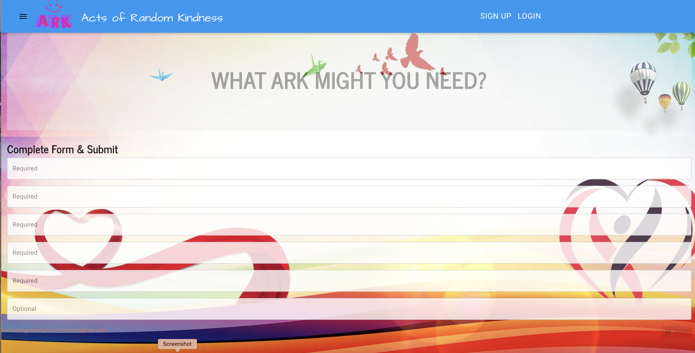
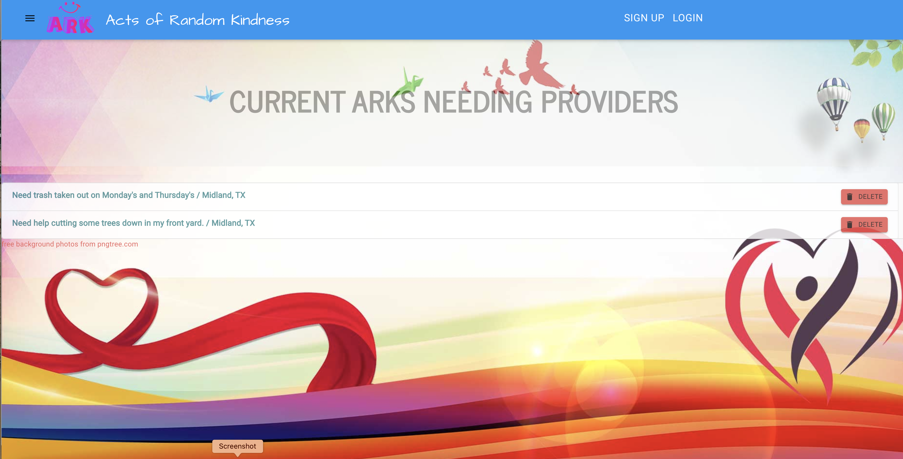

# Acts of Random Kindness (ARK)

## Project Description

Acts of Random Kindness (ARK) is a grass root movement that aims to bridge those in need with individuals or groups willing and able to provide help to better local, national and global communities. Join in the movement today to help make a difference!

## Installation Instructions

Use the app as deployed on Heroku: [ARK](https://arkcharity.herokuapp.com/). 

## Usage

Home page

Submit ARK

View ARKs

## Guidelines for Contributing

Please e-mail one of the contributors at their address listed below with any thoughts on future updates or feature suggestions.

## Tests

Test early; test often.

### Technologies Used

### :computer: :computer: :computer: :computer: :computer: :computer:

#### :memo: HTML5 :memo:

**HTML5** is a markup language used for structuring and presenting content on the World Wide Web. The goals are to improve the language with support for the latest multi-media and other new features; to keep the language both easily readable by humans and consistently understood by computers and devices; and to remain backward compatible to older software. Many new symantec features are included.

_HTML5_ content borrowed from <a target="_blank" rel="noopener noreferrer">[this page](https://en.wikipedia.org/wiki/HTML5).</a>

#### :art: CSS :art:

**Cascading Style Sheets (CSS)** is a stylesheet language used for describing the presentation of a document written in a markup language (such as HTML5). CSS is designed to enable the separation of presentation and content; including layout, colors, and fonts. This separation improves content accessibility to provide more flexibility and control in the specification of presentation characteristics, enabling multiple web pages to share formatting by specifying relevant CSS in a separate file, which reduces complexity and repetition in the structural content (HTML), as well as enabling the file to be cached to improve the page load speed between the pages that share the file and its formatting.

Separation of formatting and content also makes it feasible to present the same markup page in different styles for different rendering methods, such as on-screen, in print, by voice, and on Braille-based tactile devices.

_CSS_ content borrowed from <a target="_blank" rel="noopener noreferrer">[this page](https://en.wikipedia.org/wiki/Cascading_Style_Sheets).</a>

#### :shoe: Bootstrap 4 :shoe:

**Bootstrap 4** is a free and open-source CSS framework directed at responsive, mobile-first front-end web development. It contains CSS and (optionally) JavaScript-based design templates for typography, forms, buttons, navigation, and other interface components.

_Bootstrap 4_ content borrowed from <a target="_blank" rel="noopener noreferrer">[this page](https://en.wikipedia.org/wiki/Bootstrap\_(front-end_framework)).</a>

#### :sparkler: JavaScript :sparkler:

**JavaScript (JS)** is one of the core technologies of the World Wide Web (along with HTML and CSS). It enables interactive web pages and is an essential part of web applications. JS is a multi-faceted, scripting language that provides versatility through Application Programming Interfaces (APIs) and Document Object Model (DOM) manipulation, among others.

_JavaScript_ content borrowed from <a target="_blank" rel="noopener noreferrer">[this page](https://en.wikipedia.org/wiki/JavaScript).</a>

#### :globe_with_meridians: NODE.js :globe_with_meridians:

**NODE.js** is an open-source, cross-platform JavaScript runtime environment that execute JavaScript code outside a web browser. NODE.js lets developers use JavaScript to write command line tools and for server-side scripting. NODE.js represents a "Javascript everywhere" paradigm, unifying web-application development around a single programming language, rather than different programming languages for server- and client-side scripts.

_NODE.js_ content borrowed from <a target="_blank" rel="noopener noreferrer">[this page](https://en.wikipedia.org/wiki/Node.js).</a>

[Download Node.js](https://nodejs.org/en/).

#### :satellite: Express.js :satellite:

**Express.js** is a minimal and flexible NODE.js web application framework that provides a robust set of features for web and mobile applications. The myriad HTTP utility methods and middleware allow for the creation of a robust API. Express.js provides a thin layer of fundamental features, without obscuring NODE.js features.

_Express.js_ content borrowed from <a target="_blank" rel="noopener noreferrer">[this page](https://expressjs.com/).</a>

#### :japanese_ogre: MongoDB :japanese_ogre:

**MongoDB** is a document-oriented NoSQL database used for high volume data storage. Instead of using tables and rows like traditional databases, MongoDB makes use of collections and documents. Documents consist of key-value pairs that are the basic unit of data and more closely resemble the JSON architecture.

_MongoDB_ content borrowed from <a target="_blank" rel="noopener noreferrer">[this page](https://www.guru99.com/what-is-mongodb.html#:~:text=MongoDB%20is%20a%20document%2Doriented,use%20of%20collections%20and%20documents.&text=Collections%20contain%20sets%20of%20documents,equivalent%20of%20relational%20database%20tables).</a>

#### :dizzy: React.js :dizzy:

**React.js** is an open source JavaScript library that is used for building interfaces for single-page applications, which handles the view layer for web and mobile apps. React allows for the creation of reusable UI components. This allows developers to create large web applications that change data, without reloading the page.

_React.js_ content borrowed from <a target="_blank" rel="noopener noreferrer">[this page](https://www.c-sharpcorner.com/article/what-and-why-reactjs/#:~:text=It's%20used%20for%20handling%20the,to%20create%20reusable%20UI%20components.&text=React%20allows%20developers%20to%20create,fast%2C%20scalable%2C%20and%20simple.).</a>

### Collaborators

This ARK app was conceived, created, and coded by the following group of collaborators:

|                  _TEAM_                  |                 _Members_                  |
| :--------------------------------------: | :----------------------------------------: |
| :football: CW Porter :football: |      :beers: Mark Toups :beers:       |
|     :8ball: Calvin Estrada :8ball:      | :green_heart: Sonni Williams :green_heart: |

## Questions

Check out our Github profiles:

- [CW Porter](https://github.com/Portmeister);
- [Calvin Estrada](https://github.com/CalvinEstrada);
- [Sonni Williams](https://github.com/lovejustbry);
- [Mark Toups](https://github.com/markdlt4).

You can contact any one of use by e-mail the following:

- CW Porter - portmeister@gmail.com
- Calvin Estrada- calvine@gmail.com
- Sonni Williams - sonniw@gmail.com
- Mark Toups - toupstrades@gmail.com

for any additional questions and/ or clarifications you may need about the project.

##### License

[This application uses the **GNU Affero General Public v3.0 License** found here](./LICENSE).
